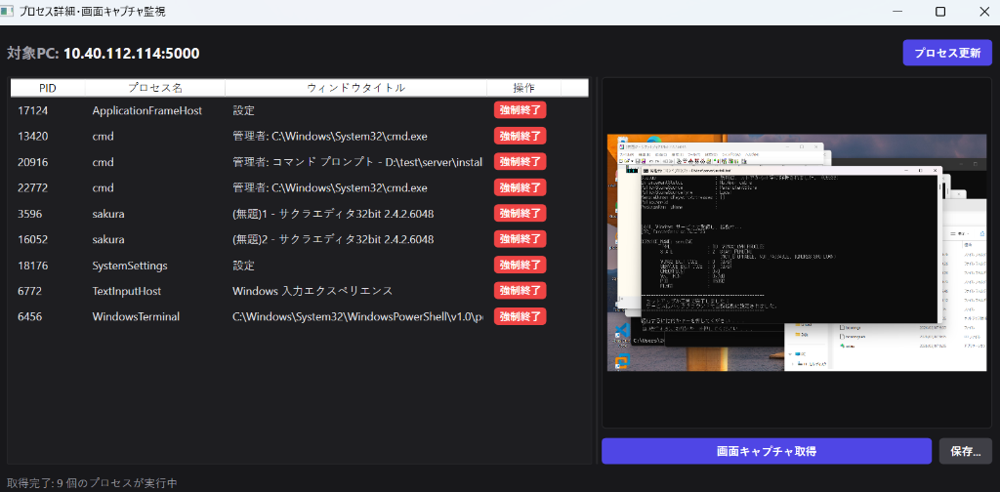

# sendCMD - 実習室PC管理用 PowerShell実行・配布システム

`sendCMD` は、教員用PC（クライアントアプリ）から実習室の生徒用PC（Windowsサービス）に対して、管理者権限（SYSTEM）でPowerShellコマンドを遠隔実行したり、ソフトウェアを配布してサイレントインストールしたりするためのシステムです。

---

## 1. フォルダ構成

本プロジェクトは C# (.NET 8) を使用したモノレポ（単一リポジトリ）構成になっています。

```text
d:\dev\sendCMD\
├── sendCMD.sln         # プロジェクト全体を管理するソリューションファイル
├── build-release.ps1   # リリースビルド自動化スクリプト
│
├── share/              # [共有ライブラリ]
│   └── Models.cs       # 通信で使用するデータ（リクエスト/レスポンス）の共通定義
│
├── server/             # [生徒PC用：Windowsサービス（WebAPIサーバー内蔵）]
│   ├── Program.cs      # APIの起動、PowerShell実行、ファイル保存等の主要処理
│   ├── appsettings.json# APIキーやファイル保存先などの設定ファイル
│   ├── install.bat     # サービスの一括自動セットアップスクリプト
│   └── uninstall.bat   # サービスのアンインストール用スクリプト
│
├── client/             # [教員PC用：デスクトップ管理画面アプリ]
│   ├── MainWindow.xaml # ダークテーマの操作画面（WPF）
│   └── MainWindow.xaml.cs# PC名・IPリストの一括生成、非同期での並列コマンド送信、ファイルアップロード処理
│
├── docs/               # [手順書・マニュアル]
│   ├── Client_Manual.md# 教員PC側の操作マニュアル（コマンド実行、ファイル配布、稼働監視）
│   └── Server_Manual.md# 生徒PC側のサービス導入マニュアル
│
└── publish/            # [ビルド成果物（ビルド後に生成されます）]
    ├── client/         # 教員PC用スタンドアロンEXE (client.exe)
    └── server/         # 生徒PC用スタンドアロンEXE (server.exe, install.bat, uninstall.bat)
```

---

## 2. クイックスタート (ビルド方法)

開発環境で実行用のファイルをコンパイル（ビルド）するには、以下の手順を行います。

1.  PowerShellを開き、プロジェクトのルートディレクトリに移動します。
2.  以下のビルドスクリプトを実行します。
    ```powershell
    .\build-release.ps1
    ```
3.  ビルドに成功すると、ルート直下に `publish` フォルダが作成され、中に .NET ランタイム不要の独立した `.exe` ファイルが出力されます。

### 🛈 サイレント（対話なし）インストール・アンインストール

実習室の複数の生徒PCへ一斉にインストール・アンインストールを行いたい場合（Active Directoryのスタートアップスクリプトや資産管理ソフト等のパッケージ配布など）、以下のコマンドを管理者権限のコマンドプロンプトやPowerShell等から実行することで、裏で対話なしで処理を完了できます。

#### ① サイレントインストール
`server.exe` と `appsettings.json` が配置されたフォルダで以下を管理者権限で実行します：
```cmd
:: インストール先フォルダの作成とファイルコピー
mkdir "C:\Program Files\sendCMD"
copy /y server.exe "C:\Program Files\sendCMD\"
copy /y appsettings.json "C:\Program Files\sendCMD\"

:: ファイアウォール許可ルールの追加 (TCP 5000ポート)
powershell -Command "New-NetFirewallRule -Name 'sendCMD' -DisplayName 'sendCMD Server' -Direction Inbound -Protocol TCP -LocalPort 5000 -Action Allow -ErrorAction SilentlyContinue"

:: Windowsサービスへの登録と起動
sc.exe create sendCMD binPath= "\"C:\Program Files\sendCMD\server.exe\"" start= auto
sc.exe start sendCMD
```

#### ② サイレントアンインストール
生徒PCからサービスとファイルを完全に削除したい場合は、以下を管理者権限で実行します：
```cmd
:: サービスの停止と削除
sc.exe stop sendCMD
sc.exe delete sendCMD

:: ファイアウォール許可ルールの削除
powershell -Command "Remove-NetFirewallRule -Name 'sendCMD' -ErrorAction SilentlyContinue"

:: ファイルの強制削除
rmdir /s /q "C:\Program Files\sendCMD"
```

---

## 3. 各マニュアルへのリンク

詳細な導入・操作方法については、以下の手順書を参照してください。

*   **生徒用PCへのセットアップ手順（管理者向け）:**
    [Server_Manual.md](file:///D:/dev/sendCMD/docs/Server_Manual.md)
    *   *バッチファイルを用いた自動セットアップ手順、ポート開放、サービスの管理方法について記述されています。*
*   **教員用PCでの操作手順（教員向け）:**
    [Client_Manual.md](file:///D:/dev/sendCMD/docs/Client_Manual.md)
    *   *PC名を用いた一括自動生成、コマンド実行、ファイルのサイレントインストール、リアルタイム稼働監視・タスク強制終了の手順について記述されています。*

---

## 4. 使用技術・システム設計詳細

本システムは、教室環境での大量のPCに対して高速かつ安定して動作するよう、以下の技術と設計を採用しています。

### ① 非同期・マルチスレッド通信 (C# Kestrel & HttpClient)
*   **生徒側 (Kestrel Web Server):**
    Microsoft製の超軽量・高性能Webサーバー「Kestrel」をバックエンドに採用しています。非同期I/O処理（IOCP）により、**同じポート（5000番）で同時に複数の通信を並行して受け入れられます。** ファイルのアップロード実行中に、同じPCに対してプロセスの確認を投げても、待たされたり接続拒否されたりすることはありません。
*   **教員側 (HttpClient & Task Parallelism):**
    教員PCからのリクエストは、すべて非同期スレッド（`Task.Run`）でPCごとに並行して送信されます。特定のPCがオフラインや高負荷で応答が遅れても、他のPCへの通信が妨げられたり、教員アプリの画面（UI）がフリーズしたりすることはありません。
*   **ソケット枯渇対策:**
    `HttpClient` のインスタンスをシングルトン（`static readonly`）として再利用することで、短時間に大量のPCと通信した際にもWindowsのソケット（ポート）が不足する問題を防止しています。

### ② Windows標準のネットワーク名前解決 (DNS / LLMNR)
*   実習室内のPC名（例: `PC-STUDENT-01`）を指定して通信する際、Windows OSが自動的に「DNS」や、ドメインのないネットワーク用の「LLMNR (Link-Local Multicast Name Resolution) / mDNS」を使用して自動的にIPアドレスを特定します。
*   これにより、DHCPによって生徒PCのIPアドレスが日々変動しても、教員アプリ側にPC名を登録しておくだけでメンテナンスフリーで繋がり続けます。

### ③ Session 0 隔離の回避 (画面キャプチャ・プロセス監視)
*   **Session 0 隔離の問題:**
    Windowsサービスはセキュリティ上の理由から、ユーザーの画面やデスクトップと対話できない「Session 0」と呼ばれる独立したセッションで隔離実行されます。このため、サービスから直接画面キャプチャを撮影しようとしても、デスクトップ（`winsta0\default`）のハンドルが取得できず、真っ黒な画像になるか「ハンドルが無効です」というGDIエラーになります。また、プロセスの「ウィンドウタイトル」等もSession 0からは取得できません。
*   **CreateProcessAsUserによる解決:**
    本システムは、要求受信時にアクティブなコンソールセッション（生徒が実際に操作している Session 1 等のデスクトップセッション）を動的に検出し、WTS（Windows Terminal Services）APIを用いてそのセッションのユーザートークンを複製します。そして **`CreateProcessAsUser` APIを使用して、ログイン中ユーザーのデスクトップ（`winsta0\default`）に直接PowerShellプロセスを注入・実行** します。
    これにより、タスクスケジューラ（`schtasks.exe`）等の制限の多い外部コマンドに依存することなく、高速かつ確実に対話型デスクトップへアタッチし、正しい画面キャプチャや実行中アプリ名を取得することができます。

### ④ 一般ユーザーログイン状態での管理者インストール (UACの突破)
*   生徒PCにサインインしているのが管理者権限を持たない「一般ユーザー（制限ユーザー）」であっても、本システムを使えば管理者権限が必要なソフトウェアをリモートから強制インストールできます。
*   `sendCMD` サービス自体がWindowsの最高権限である `SYSTEM` アカウント下で動作しているため、配布したインストーラーは UAC（ユーザーアカウント制御）のプロンプトでブロックされることなく、サイレント（無人）パラメータ（`/qn` や `/silent` など）を伴ってバックグラウンドで管理者権限で実行・完了します。

---

## 5. PowerShell 実行時の仕様と注意点

教員コンソールの「PowerShell 実行」タブからコマンドを実行する際、以下の仕様と注意点があります。

### ① 入力欄には「ピュアなPowerShellコマンド」のみを記述する
教員コンソールの入力欄は、生徒PCのサーバー側でそのままPowerShellスクリプトとして読み込まれて実行される仕様です。
そのため、**入力欄に `powershell -Command "..."` や `powershell.exe` のような起動ラッパーコマンドを含める必要はありません（二重起動による構文エラーや出力取得失敗の原因になります）。** また、コマンドプロンプトの改行記号（`^`）なども使用しないでください。

*   **❌ 誤った入力例:**
    ```powershell
    powershell -NoProfile -ExecutionPolicy Bypass -Command "Get-Process"
    ```
*   **✅ 正しい入力例:**
    ```powershell
    Get-Process | Where-Object { $_.MainWindowTitle } | Select-Object ProcessName, Id, MainWindowTitle
    ```

### ② 実行アカウントは `SYSTEM` 権限
通常の「PowerShell 実行」タブから送られたコマンドは、サービスと同じ **`NT AUTHORITY\SYSTEM`** 権限（ローカルPCにおける最高管理者権限）で実行されます。
これにより、環境設定の変更やソフトウェアのサイレントインストールなどを制限なく実行できます。

*   **実行アカウントの確認用コマンド:**
    ```powershell
    [Security.Principal.WindowsIdentity]::GetCurrent().Name
    # 出力結果: NT AUTHORITY\SYSTEM
    ```

### ③ 他ユーザーとしての実行 (su / sudo 相当の処理)
SYSTEM権限から特定のローカルユーザーや管理者ユーザーに切り替えてコマンドを実行したい場合は、スクリプト内で `PSCredential` を作成して `Start-Process` に渡すことで実行できます。

*   **実行例:**
    ```powershell
    $password = ConvertTo-SecureString "パスワード" -AsPlainText -Force
    $cred = New-Object System.Management.Automation.PSCredential ("切り替え先ユーザー名", $password)
    Start-Process powershell.exe -Credential $cred -ArgumentList "-NoProfile -Command '実行したいコマンド'"
    ```

### ④ MSIX / APPX パッケージの配布とインストールの注意点
ファイル配布タブから `.msix` または `.appx` 拡張子のパッケージファイルを配布する際、システムは自動的に特別なフローを実行します。

*   **実行セッションの自動切り替え:**
    MSIXはユーザーのプロファイル領域にアプリを登録する仕様であるため、`SYSTEM` 権限ではなく、**「現在ログインしている生徒の対話型ユーザーセッション」に自動で切り替えて** インストール（`Add-AppxPackage`）が実行されます。
*   **すでにインストール済みの場合の挙動 (瞬時終了):**
    対象PCに全く同じバージョンのアプリパッケージがすでに存在している場合、Windowsの仕様上インストール処理が自動的にスキップされ、**何も出力せず瞬時に正常終了（ExitCode: 0）** します。
    *新規インストールの挙動や進行状況を検証したい場合は、あらかじめ対象PCから `Remove-AppxPackage` を実行してアンインストールしておく必要があります。*
*   **エラーログの可視化:**
    対話型セッションで実行されたコマンドでエラーが発生した場合、内部でエラー（STDERR）と標準出力（STDOUT）が自動的にマージされ、教員アプリ側のログに赤いPowerShellエラーメッセージがしっかりと表示されます。

---

## 6. 画面イメージ (実行例)

以下は、教員用PCから特定の生徒PCをダブルクリックし、リアルタイムでの画面キャプチャ監視および実行中のプロセス一覧（ウィンドウタイトル付）を取得・監視している様子です。



---

## 7. GitHub Actions (CI/CD)

本リポジトリには、GitHub Actions を利用した自動テストおよびリリース作成パイプラインが組み込まれています。

*   **自動テスト (CI - Continuous Integration)**
    *   `main` ブランチへの `push`、およびすべての `pull_request` 時に自動的にトリガーされます。
    *   WPFクライアントのテスト実行要件を満たすため、**`windows-latest`** ランナー上で .NET 8 ビルドおよび全テスト（`dotnet test`）を実行し、ビルドとロジックの健全性を検証します。
*   **リリース作成 (CD - Continuous Deployment)**
    *   `v*` 形式のバージョンタグ（例: `v1.3.2`）が GitHub にプッシュされたときにトリガーされます。
    *   `build-release.ps1` を使用したビルド成果物のパブリッシュ、教員用クライアントと生徒用サーバーの個別 zip パッケージング、および **GitHub Releases への下書き（Draft）リリース自動作成** とアセットのアップロードを自動で行います。

