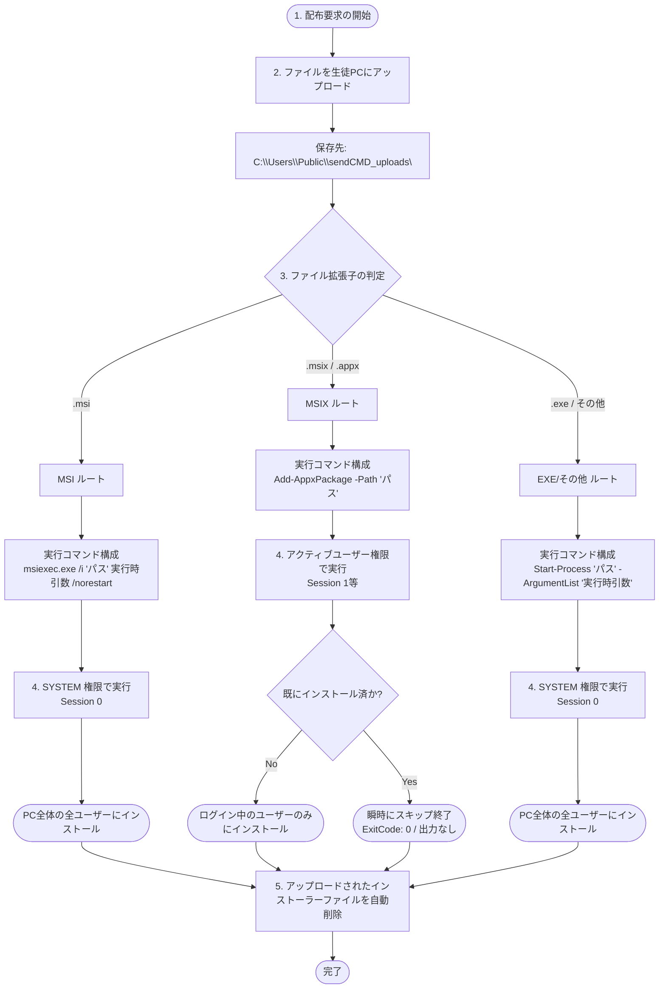

# sendCMD - ファイル配布とインストール機能 仕様書

本ドキュメントは、教員コンソールから生徒PCへファイルを配布し、遠隔でインストールを行う機能の内部仕様、条件分岐、および実行時引数の設定方法について記述します。

---

## 1. 全体処理フロー（条件分岐）

配布されたファイルの拡張子（`.msi` / `.msix` / `.exe`）に応じて、自動的に最適な実行セッションおよびインストールコマンドが選択されます。



---

## 2. 拡張子別の詳細仕様

### ① MSI インストーラー (`.msi`)
*   **実行アカウント**: `NT AUTHORITY\SYSTEM` (Session 0)
*   **実行コマンド**:
    ```powershell
    Start-Process msiexec.exe -ArgumentList "/i `"<ファイルパス>`" <実行時引数> /norestart" -Wait -PassThru
    ```
*   **インストール範囲**: **全ユーザー（マシン全体）**
*   **説明**:
    Windowsの標準インストーラーサービス（MSI）を使用してバックグラウンドで実行します。教員UIの「実行時引数」に設定した内容がそのまま `msiexec` に引き渡されます。

### ② MSIX / APPX パッケージ (`.msix`, `.appx`)
*   **実行アカウント**: **ログイン中の生徒ユーザーの権限** (Session 1 等のアクティブセッション)
*   **実行コマンド**:
    ```powershell
    Add-AppxPackage -Path "<ファイルパス>"
    ```
*   **インストール範囲**: **操作中の生徒ユーザーのみ**
*   **説明**:
    MSIXパッケージはユーザー固有のサンドボックス環境に登録されます。SYSTEM権限でインストールすると生徒が使用できないため、システムが自動的に**「現在サインインしている生徒のデスクトップセッション」へ権限を切り替えて（複製トークンを使用して）実行**します。

### ③ 実行ファイル (`.exe`)
*   **実行アカウント**: `NT AUTHORITY\SYSTEM` (Session 0)
*   **実行コマンド**:
    ```powershell
    Start-Process "<ファイルパス>" -ArgumentList "<実行時引数>" -Wait -PassThru
    ```
*   **インストール範囲**: 通常は**全ユーザー（マシン全体）**
*   **説明**:
    実行ファイル形式のインストーラーです。SYSTEM権限で実行するため管理者特権を持ちますが、UAC（ユーザーアカウント制御）の確認ダイアログが表示されない環境（Session 0）で動作するため、**必ず正しい「サイレント（無人）インストール用引数」を指定する必要があります。**

---
## 3. 手動での実行ユーザー権限切り替え

教員アプリの「ファイル配布とインストール」タブに新設された **「ログインユーザー権限で実行する」** チェックボックスを利用すると、拡張子の自動判別ルールに関わらず、手動で実行アカウント（権限）を切り替えることができます。

*   **チェックボックスが「オフ」の場合 (デフォルト)**
    *   `.msi` / `.exe` などの汎用インストーラーは **`SYSTEM` 権限** (Session 0) で実行され、マシン全体へインストールされます。
    *   `.msix` / `.appx` パッケージは、動作要件のため自動的に強制で **ログインユーザー権限** (対話セッション) で実行されます。
*   **チェックボックスを「オン」にするべきケース**
    *   一般ユーザー（生徒）のプロファイルフォルダ（`AppData` 配下）内にのみインストールを行うタイプの `.exe` インストーラー（例: Discord や VS Code の User Installer）を配布する際、これをオンにして配布することで、管理者権限なしの生徒ユーザー環境に正常に配置することができます。

---

## 4. 「実行時引数」の設定方法（重要）

リモートから実行するため、セットアップ画面（UI）が表示されない**サイレント（無人）実行用スイッチ**を指定する必要があります。これを指定しないと、裏で「次へ」ボタンの入力を待ち続け、最終的にタイムアウトエラーになります。

### 主要なインストーラー形式と引数の指定例

| 拡張子 / 形式 | 推奨される実行時引数 | 説明 |
| :--- | :--- | :--- |
| **`.msi`** | `/qn` (初期値) | 完全サイレント（UIなし）。自動で適用されます。 |
| **`.exe` (InstallShield製)** | `/s /v"/qn"` | インストーラーとMSIエンジン両方を無人化します。 |
| **`.exe` (Inno Setup製)** | `/VERYSILENT /SUPPRESSMSGBOXES /NORESTART` | メッセージボックスや再起動の確認を抑止します。 |
| **`.exe` (Nullsoft/NSIS製)** | `/S` | 大文字の `/S` です（小文字の `/s` は無効な場合があります）。 |
| **`.exe` (WiX Toolset製)** | `/quiet /norestart` | WiXで作成されたセットアッププログラムの無人化です。 |

> [!WARNING]
> **EXEファイルのサイレントスイッチは大文字・小文字を厳格に区別するものが多いです。**
> 動作しない場合は、あらかじめコマンドプロンプトで `インストーラー名.exe /?` や `/?` を実行して、正しいヘルプドキュメントでサイレント引数を確認してください。

---

## 4. 特有のトラブルシューティングと注意点

### MSIXの「一瞬で終わる（ExitCode: 0）」現象について
*   **現象**: MSIXファイルを配布した際、ログに「リモート実行完了。ExitCode: 0」と出ているのに、アプリがどこにもインストールされていないように見える。
*   **原因**: Windowsの仕様上、**すでに全く同じバージョンのパッケージがインストールされている場合、`Add-AppxPackage` は何も処理をせず、出力も空のまま数ミリ秒で正常終了（ExitCode: 0）します。**
*   **対策**:
    動作検証等で最初からインストールされる挙動を確認したい場合は、事前に以下のコマンドを「PowerShell実行」タブから送ってアンインストールしてください：
    ```powershell
    # インストール済みパッケージの削除
    Remove-AppxPackage -Package <パッケージフルネーム>
    ```

### アップロード保存先のセキュリティと権限
*   アップロードされたファイルは一時的に **`C:\Users\Public\sendCMD_uploads\`** に格納されます。
*   このフォルダは、SYSTEM権限が書き込みを行えるだけでなく、一般ユーザーの権限（生徒）でも読み取りと実行ができるため、Session 0 隔離を回避して安全にインストールを行うための共通ブリッジ領域として使用されます。インストール完了後は自動的に削除されます。
