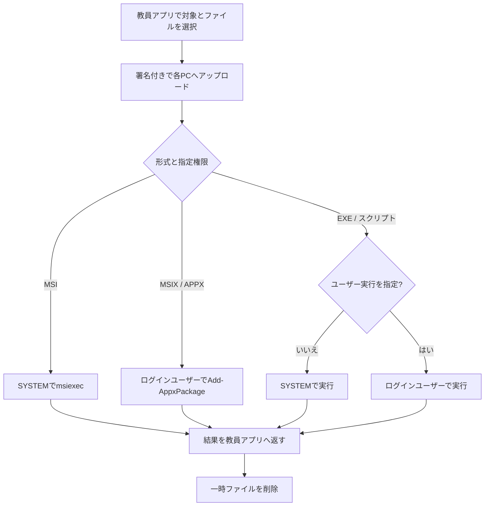

# ファイル配布と実行の仕様

この文書は、教員アプリから生徒PCへファイルを送り、実行する機能の内部仕様を示します。

## 処理の流れ

アップロードと実行はPCごとに独立して行います。停止中のPCや失敗したPCがあっても、他PCの処理は継続します。

## アップロード

- エンドポイント: `POST /api/upload`
- 形式: `multipart/form-data`、フィールド名`file`
- 認証: UTC時刻、HTTPメソッド、パスを含むHMAC-SHA256署名
- 既定保存先: `C:\Users\Public\sendCMD_uploads`
- 既定上限: 524,288,000バイト（500 MiB）
- 上限設定: `server/appsettings.json`の`MaxUploadBytes`

通信層、フォーム解析、受信ファイルの3段階でサイズを制限します。空ファイル、フォーム形式でない要求、上限超過は拒否します。

受信したファイル名は次のように処理します。

1. フォルダー部分を除去します。
2. 不正文字と制御文字を`_`へ置換します。
3. ベース名を80文字、拡張子を16文字へ制限します。
4. 12文字の一意な接尾辞を追加します。
5. 正規化後のパスが保存先配下であることを確認します。
6. 新規作成専用で保存し、既存ファイルを上書きしません。

成功時は保存先とサイズをサーバーログへ記録します。

## 形式別の実行

| 形式 | 既定の実行先 | 主な処理 | 用途 |
| --- | --- | --- | --- |
| `.msi` | SYSTEM / Session 0 | `msiexec.exe /i` | PC全体への導入 |
| `.msix`, `.appx` | ログインユーザー | `Add-AppxPackage` | ユーザー単位の導入 |
| `.exe` | SYSTEM / Session 0 | `Start-Process -Wait` | 製品固有インストーラー |
| その他 | SYSTEMまたは指定ユーザー | PowerShellから実行 | スクリプトや補助ファイル |

MSIX/APPXは仕様上、ログインユーザーで実行します。ログインユーザーがいない場合は実行できません。同じバージョンが導入済みの場合、出力なし・終了コード0で短時間に完了することがあります。

EXEは画面操作を伴わない引数が必要です。引数は製品の公式手順で確認してください。

| 種類 | 代表的な引数例 |
| --- | --- |
| MSI | `/qn /norestart` |
| Inno Setup | `/VERYSILENT /SUPPRESSMSGBOXES /NORESTART` |
| NSIS | `/S` |
| WiX系EXE | `/quiet /norestart` |

例は保証値ではありません。大文字小文字を含め、配布する製品の仕様を優先します。

## 権限指定

「ログインユーザー権限で実行する」がオフの場合、MSI、EXE、通常スクリプトはSYSTEMで実行します。オンの場合は、ログイン中のユーザーの対話セッションで実行します。

ユーザーの`AppData`へ導入する製品や、ユーザープロファイルを参照する処理ではオンを使用します。PC全体の設定変更、サービス操作、マシン単位インストールではオフを使用します。

## 後片付けと障害時

実行完了後、教員アプリは一時ファイルを削除します。通信断、サービス停止、インストーラーの異常終了などでは残る場合があります。`UploadDirectory`の容量を定期確認し、処理中でない古いファイルだけを管理者が削除してください。

問題調査では次を揃えます。

- 教員アプリの操作ログ
- 生徒PCの`C:\Users\Public\sendCMD_server_log.txt`
- 対象PC、発生時刻、ファイル名とサイズ
- 実行形式、引数、SYSTEM/ログインユーザーの指定
- 終了コードと標準出力・エラー出力

## 検証項目

- 空ファイルと上限超過が拒否されること
- 日本語、空白、長い名前、不正文字を含むファイル名が安全に保存されること
- 同名ファイルを続けて送っても衝突しないこと
- 停止中PCを含む複数台で他PCの処理が継続すること
- MSI、MSIX/APPX、EXEの各ルートが期待した権限で動くこと
- 異常終了後に残った一時ファイルを確認・回収できること
